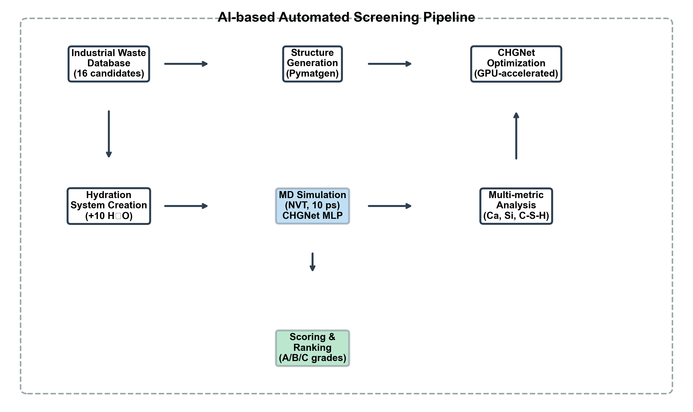
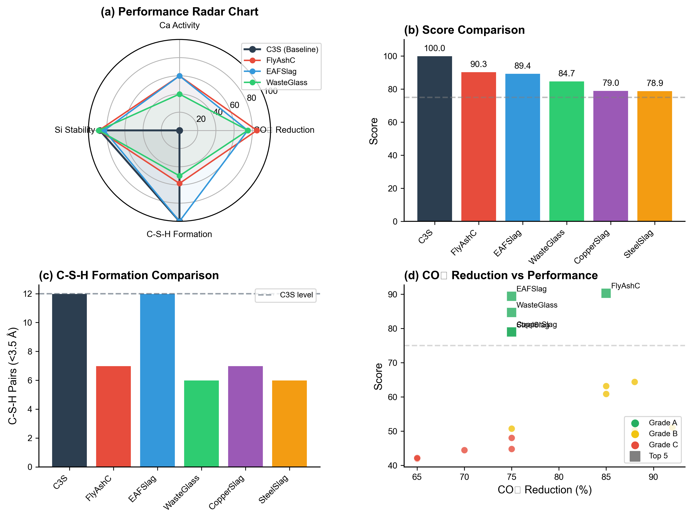
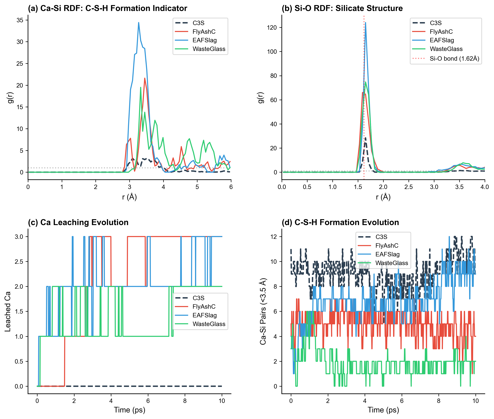
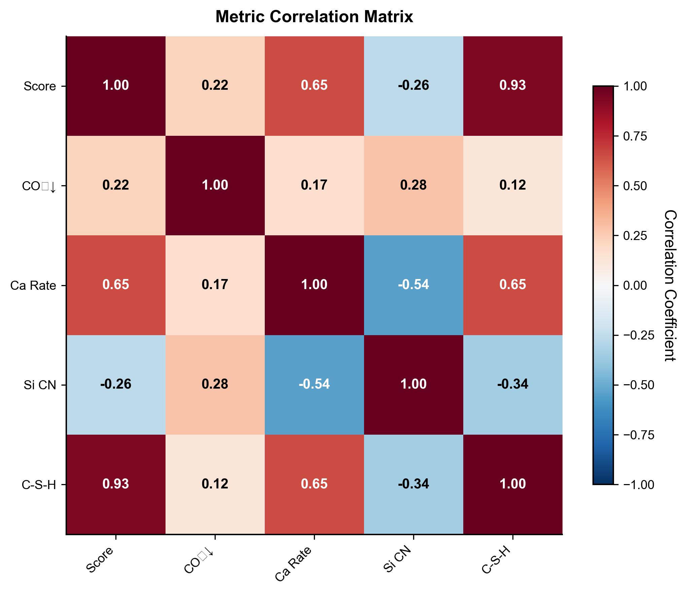

# 논문용 Figure 생성 결과

> **실행일**: 2026-01-29  
> **노트북**: `notebooks/pipeline/06_Paper_Figures.ipynb`  
> **문서번호**: 06 (노트북 번호와 동일)  
> **상태**: ✅ 완료

---

## 1. 개요

### 1.1 목적
AI 기반 저탄소 시멘트 대체재 스크리닝 연구의 논문용 고품질 Figure 생성

### 1.2 생성 Figure 목록

| Figure | 파일명 | 형식 | 용도 |
|--------|--------|:----:|------|
| Fig. 1 | Fig1_Pipeline_Overview | PNG, PDF | 방법론 흐름도 |
| Fig. 2 | Fig2_Screening_Results | PNG, PDF | 16개 후보 스크리닝 결과 |
| Fig. 3 | Fig3_Top5_Comparison | PNG, PDF | Top 5 vs C3S 상세 비교 |
| Fig. 4 | Fig4_Molecular_Analysis | PNG, PDF | 분자 수준 RDF/Evolution |
| Fig. S1 | FigS1_Correlation_Heatmap | PNG, PDF | 상관 행렬 (보충 자료) |

### 1.3 스타일 설정

| 항목 | 설정 |
|------|------|
| 폰트 | Arial |
| 기본 크기 | 10pt |
| 해상도 | 300 DPI |
| 출력 형식 | PNG + PDF |

---

## 2. Figure 상세 설명

### 2.1 Figure 1: Pipeline Overview



**내용**: AI 기반 자동화 스크리닝 파이프라인 흐름도

**구성 요소**:
1. **Industrial Waste Database** - 16개 산업 폐기물 후보
2. **Structure Generation** - Pymatgen 기반 구조 생성
3. **CHGNet Optimization** - GPU 가속 구조 최적화
4. **Hydration System Creation** - 물 분자 추가 (+10 H₂O)
5. **MD Simulation** - NVT 앙상블, 10 ps
6. **Multi-metric Analysis** - Ca 용출, Si 배위수, C-S-H 형성
7. **Scoring & Ranking** - A/B/C 등급 분류

---

### 2.2 Figure 2: Screening Results


**내용**: 16개 후보의 종합 스크리닝 결과

**서브플롯**:
- **(a) Screening Scores**: 총점 기준 정렬, 등급별 색상 구분
- **(b) CO₂ Reduction Potential**: CO₂ 저감률 비교
- **(c) Ca Leaching Activity**: Ca 용출 속도 비교
- **(d) C-S-H Formation Potential**: C-S-H 쌍 형성 비교

**핵심 메시지**:
- A등급 5개, B등급 6개, C등급 5개
- FlyAshC가 최고점 (90.3점)
- EAFSlag가 C-S-H 형성 최다 (12쌍)

---

### 2.3 Figure 3: Top 5 Comparison



**내용**: Top 5 후보와 C3S baseline 상세 비교

**서브플롯**:
- **(a) Performance Radar Chart**: 4개 지표 레이더 차트
- **(b) Score Comparison**: 점수 막대 그래프
- **(c) C-S-H Formation Comparison**: C-S-H 쌍 비교
- **(d) CO₂ Reduction vs Performance**: 산점도

**핵심 메시지**:
- FlyAshC: 가장 균형 잡힌 성능
- EAFSlag: C3S와 동등한 C-S-H 형성 (12쌍)
- CO₂ 저감과 성능의 약한 상관관계

---

### 2.4 Figure 4: Molecular Analysis



**내용**: 분자 수준 RDF 및 시간 변화 분석

**서브플롯**:
- **(a) Ca-Si RDF**: C-S-H 형성 지표
- **(b) Si-O RDF**: 실리케이트 구조 안정성
- **(c) Ca Leaching Evolution**: 시간에 따른 Ca 용출
- **(d) C-S-H Formation Evolution**: 시간에 따른 C-S-H 쌍 변화

**핵심 메시지**:
- Ca-Si RDF 피크 (3.0-3.5 Å): C-S-H 형성 증거
- Si-O 첫 피크 (1.62 Å): SiO₄ 사면체 결합
- EAFSlag: 지속적인 C-S-H 쌍 증가

---

### 2.5 Figure S1: Correlation Heatmap (보충 자료)



**내용**: 평가 지표 간 상관관계 분석

**핵심 상관관계**:
| 지표 쌍 | 상관계수 | 해석 |
|---------|:--------:|------|
| Score - C-S-H | **0.94** | 강한 양의 상관 |
| Score - Ca Rate | **0.65** | 중간 양의 상관 |
| Ca Rate - Si CN | **-0.54** | 중간 음의 상관 |
| Score - CO₂ | 0.22 | 약한 상관 |

---

## 3. 컬러 팔레트

### 3.1 재료별 색상

| 재료 | 색상 코드 | 용도 |
|------|:---------:|------|
| C3S (Baseline) | `#2c3e50` | 진한 회색 |
| FlyAshC | `#e74c3c` | 빨강 |
| EAFSlag | `#3498db` | 파랑 |
| WasteGlass | `#2ecc71` | 초록 |
| CopperSlag | `#9b59b6` | 보라 |
| SteelSlag | `#f39c12` | 주황 |

### 3.2 등급별 색상

| 등급 | 색상 코드 | 점수 범위 |
|:----:|:---------:|:---------:|
| A | `#27ae60` | 75-100 |
| B | `#f1c40f` | 50-74 |
| C | `#e74c3c` | 0-49 |

---

## 4. 생성된 파일

### 4.1 파일 목록

```
figures/paper/
├── Fig1_Pipeline_Overview.png     (PNG, 300 DPI)
├── Fig1_Pipeline_Overview.pdf     (벡터)
├── Fig2_Screening_Results.png
├── Fig2_Screening_Results.pdf
├── Fig3_Top5_Comparison.png
├── Fig3_Top5_Comparison.pdf
├── Fig4_Molecular_Analysis.png
├── Fig4_Molecular_Analysis.pdf
├── FigS1_Correlation_Heatmap.png
└── FigS1_Correlation_Heatmap.pdf
```

### 4.2 파일 형식 권장

| 용도 | 권장 형식 |
|------|:---------:|
| 저널 제출 | PDF |
| 발표 자료 | PNG |
| 웹 게시 | PNG |
| 고품질 인쇄 | PDF |

---

## 5. 논문 캡션 초안

### Figure 1
**AI-based automated screening pipeline for low-carbon cement binder discovery.** The pipeline consists of seven steps: (1) industrial waste database containing 16 candidate materials, (2) structure generation using Pymatgen, (3) CHGNet-based structural optimization, (4) hydration system creation with 10 water molecules, (5) molecular dynamics simulation (NVT, 10 ps), (6) multi-metric analysis including Ca leaching, Si coordination, and C-S-H formation, and (7) scoring and ranking with grade classification.

### Figure 2
**Comprehensive screening results for 16 industrial waste candidates.** (a) Total screening scores with grade thresholds (A: ≥75, B: ≥50, C: <50). (b) CO₂ reduction potential compared to OPC. (c) Ca leaching activity during hydration simulation. (d) C-S-H formation potential measured by Ca-Si pairs within 3.5 Å. The dashed line in (d) indicates the C3S baseline level.

### Figure 3
**Detailed comparison between top 5 candidates and C3S baseline.** (a) Radar chart showing normalized performance metrics for CO₂ reduction, Ca activity, Si stability, and C-S-H formation. (b) Score comparison bar chart. (c) C-S-H pairs comparison with C3S reference line. (d) Scatter plot of CO₂ reduction versus screening score, with symbols indicating grade (square: Top 5, circle: others).

### Figure 4
**Molecular-level analysis of hydration behavior.** (a) Ca-Si radial distribution function (RDF) as an indicator of C-S-H formation. (b) Si-O RDF showing silicate tetrahedral structure stability. (c) Time evolution of Ca leaching during 10 ps simulation. (d) Time evolution of C-S-H pairs formation. Dashed lines represent C3S baseline.

### Figure S1
**Correlation matrix of screening metrics.** Strong positive correlation (r = 0.94) between C-S-H pairs and total score confirms C-S-H formation as the primary determinant of binder performance. Ca leaching rate shows moderate correlation (r = 0.65) with score, while CO₂ reduction exhibits weak correlation (r = 0.22).

---

## 6. 파이프라인 완료 현황

### 6.1 노트북-문서 매칭

| 노트북 | 문서 | 상태 |
|--------|------|:----:|
| 01_Setup_Validation | (불필요) | - |
| 02_Baseline_Reference | (불필요) | - |
| 03_Candidate_Database | (불필요) | - |
| 04_Screening_Pipeline | 04_Screening_Results.md | ✅ |
| 05_Results_Analysis | 05_Results_Analysis.md | ✅ |
| 06_Paper_Figures | 06_Paper_Figures.md | ✅ |

### 6.2 프로젝트 완료 상태

| 단계 | 내용 | 상태 |
|------|------|:----:|
| Phase 1 | 환경 설정 및 검증 | ✅ |
| Phase 2 | 데이터베이스 구축 | ✅ |
| Phase 3 | 자동화 스크리닝 | ✅ |
| Phase 4 | 심층 분석 | ✅ |
| Phase 5 | 논문 Figure 생성 | ✅ |
| Phase 6 | 논문 작성 | 📝 진행 중 |

---

## 7. 다음 단계

### 7.1 논문 작성
- Abstract 작성
- Introduction 작성
- Methods 섹션 작성
- Results & Discussion 작성
- Conclusion 작성

### 7.2 추가 분석 (선택)
- 장시간 MD 시뮬레이션 (100 ps)
- 혼합 시스템 연구
- 실험 검증 계획

---

**작성일**: 2026-01-29  
**상태**: ✅ 논문 Figure 생성 완료
